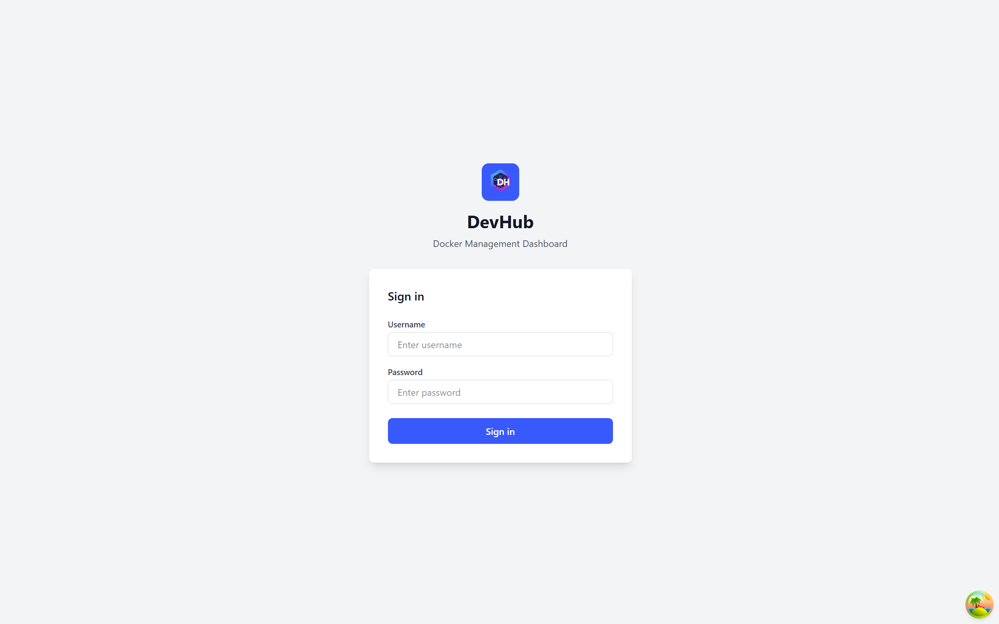
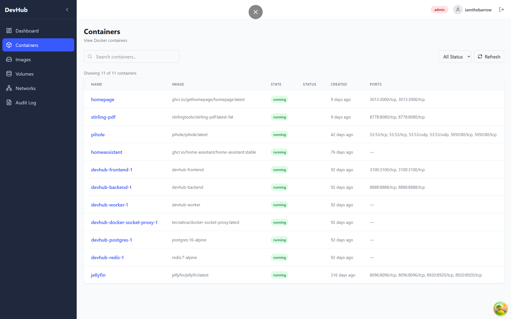
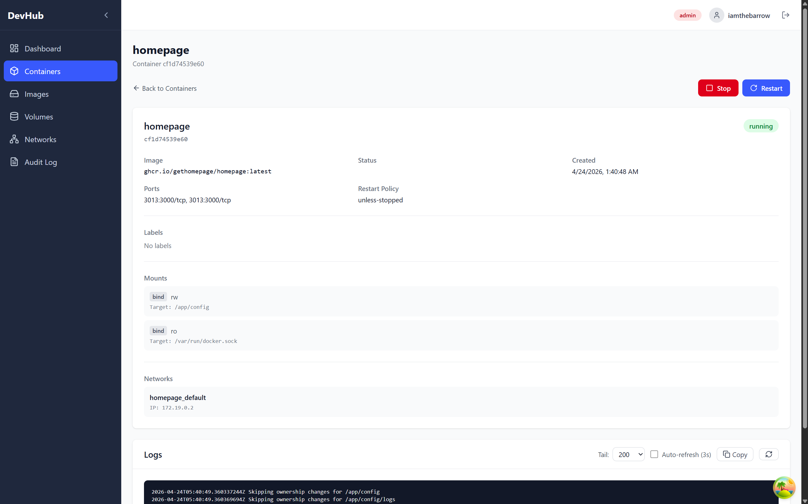
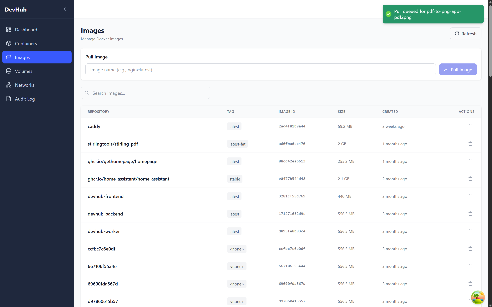
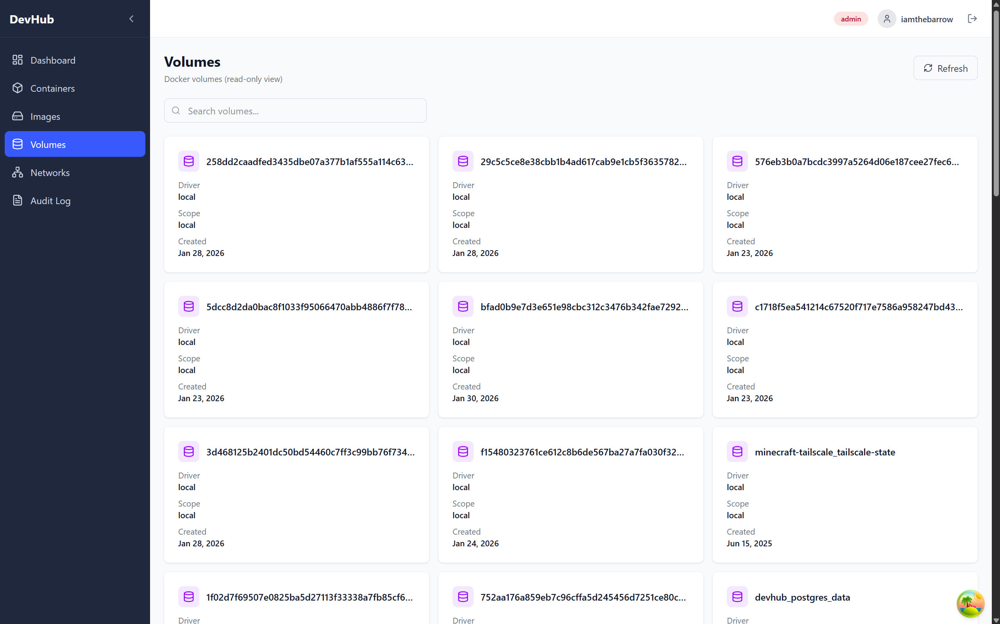
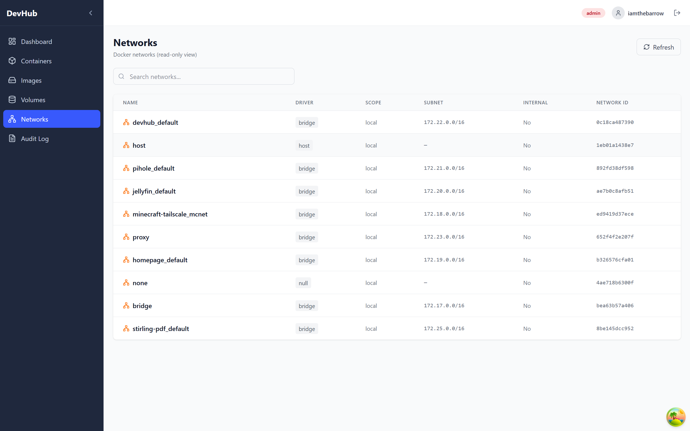
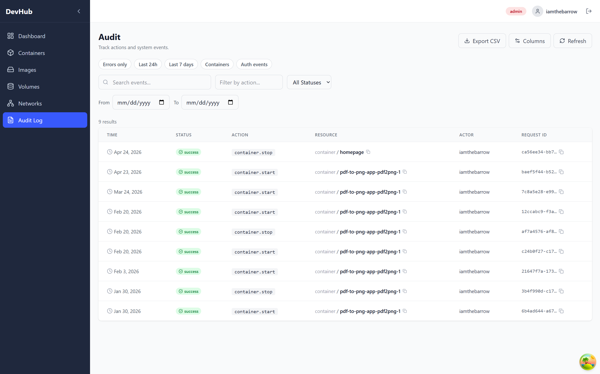
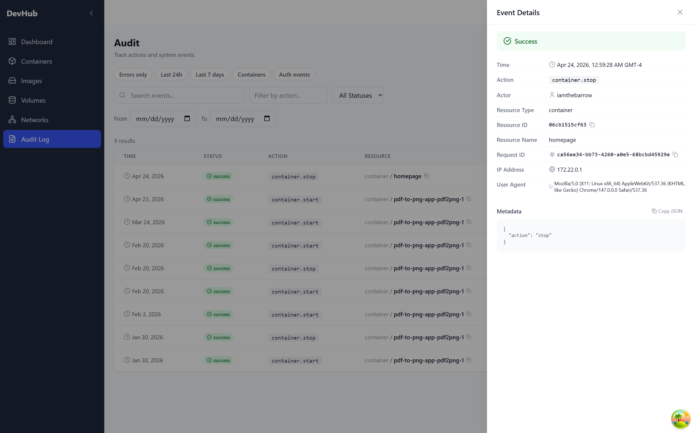
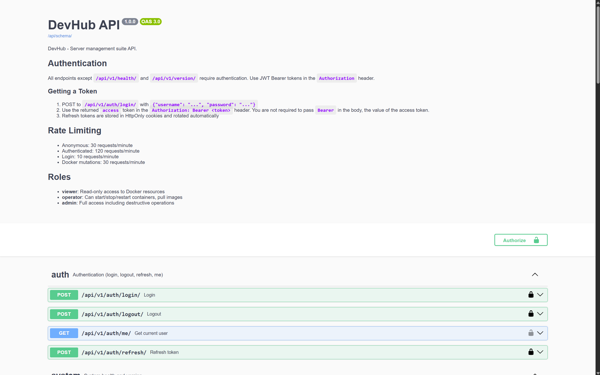

# Features

A deep-dive into each feature: what it does, where it lives in the codebase, how you interact with it, and notes for future development.

---

## Authentication and Session Management

### What It Does

DevHub uses **JWT-based authentication** with a two-token model:

- **Access token**: short-lived (10 min), stored in memory only, sent as a `Bearer` header
- **Refresh token**: long-lived (14 days), stored as an HttpOnly cookie, never accessible to JavaScript

This means your session persists across page refreshes without storing credentials in localStorage where XSS attacks could reach them.

### Where It Lives

| Layer | Location |
|---|---|
| Backend auth endpoints | `backend/devhub-backend/apps/accounts/` |
| JWT config | `.env` → `JWT_ACCESS_LIFETIME_MINUTES`, `JWT_REFRESH_LIFETIME_DAYS` |
| Frontend auth store | `frontend/devhub-frontend/src/features/auth/authStore.ts` |
| Token refresh logic | `frontend/devhub-frontend/src/api/client.ts` |
| Auth bootstrap (app load) | `frontend/devhub-frontend/src/features/auth/AuthBootstrap.tsx` |

### How It Works

1. User logs in → backend returns an access token in the response body and a refresh cookie
2. Frontend stores the access token in Zustand (memory only)
3. Every API request includes `Authorization: Bearer <token>`
4. When the access token expires, the frontend automatically calls `/auth/refresh/` using the cookie
5. If the refresh also fails, the user is redirected to login
6. A **single-flight lock** in the HTTP client ensures only one refresh request fires even if multiple API calls 401 simultaneously

---

## Role-Based Access Control (RBAC)

### What It Does

DevHub has three roles, implemented using Django's built-in Group model:

| Role | Can Read | Can Start/Stop/Restart | Can Remove Images | Can View Audit |
|---|---|---|---|---|
| `viewer` | ✓ | ✗ | ✗ | ✓ |
| `operator` | ✓ | ✓ | ✗ | ✓ |
| `admin` | ✓ | ✓ | ✓ | ✓ |

The UI adapts to the user's role: action buttons that the user cannot use are hidden rather than just disabled.

### Where It Lives

| Layer | Location |
|---|---|
| Backend permission classes | `backend/devhub-backend/apps/docker_manager/permissions.py` |
| Role bootstrap command | `backend/devhub-backend/apps/accounts/management/commands/devhub_bootstrap_roles.py` |
| Frontend role helpers | `frontend/devhub-frontend/src/features/auth/` |

### Notes for Future Improvement

- Roles are currently group-based (Django built-in). A custom user model with profile fields is planned for Phase 2.
- Per-resource permissions (e.g. a user who can only manage specific containers) are not yet implemented.

---

## Container Management

### What It Does

The container list and detail views let you see all Docker containers on your host (running, stopped, paused, or exited) and take action on them.

**Actions available (Operator+ only):**
- Start a stopped container
- Stop a running container
- Restart a running container

**Read access (all roles):**
- Container metadata (ID, image, status, ports, volumes, environment)
- Live log tailing

### Where It Lives

| Layer | Location |
|---|---|
| Backend views | `backend/devhub-backend/apps/docker_manager/views/` |
| Backend serializers | `backend/devhub-backend/apps/docker_manager/serializers.py` |
| Docker service | `backend/devhub-backend/apps/docker_manager/services/docker_service.py` |
| Frontend page | `frontend/devhub-frontend/src/pages/ContainersPage.tsx` |
| Frontend detail | `frontend/devhub-frontend/src/pages/ContainerDetailPage.tsx` |
| Frontend hooks | `frontend/devhub-frontend/src/features/docker/` |

### Notes for Future Improvement

- Log streaming is currently tail-based (last N lines). Real-time WebSocket streaming is a natural next step.
- No container creation or removal from the UI; this is by design for safety.

---

## Image Management

### What It Does

The Images page lets you see all Docker images stored locally and take basic actions:

- **Pull** a new image (e.g. `nginx:latest`, `postgres:16-alpine`); runs as an async Celery task
- **Remove** an image (Admin only), removes the image from the Docker host

### Where It Lives

| Layer | Location |
|---|---|
| Backend views | `backend/devhub-backend/apps/docker_manager/views/` |
| Celery task (image pull) | `backend/devhub-backend/apps/docker_manager/tasks.py` |
| Frontend page | `frontend/devhub-frontend/src/pages/ImagesPage.tsx` |

!!! note "Needs Confirmation: Async Pull Status"
    The image pull runs as a Celery background task. Whether pull progress or completion status is surfaced back to the UI is unclear from the current codebase. Confirm this behaviour before documenting it further.

---

## Volumes and Networks (Read-Only)

### What They Do

These two views give you visibility into your Docker volumes and networks without allowing any mutations. Useful for understanding your environment without risk of accidentally removing something important.

### Where They Live

| Layer | Location |
|---|---|
| Backend views | `backend/devhub-backend/apps/docker_manager/views/` |
| Frontend: Volumes | `frontend/devhub-frontend/src/pages/VolumesPage.tsx` |
| Frontend: Networks | `frontend/devhub-frontend/src/pages/NetworksPage.tsx` |

---

## Audit Log

### What It Does

Every significant action taken through DevHub is written to an immutable audit log. This includes:

- Login and logout events
- Container start, stop, and restart
- Image pull and remove
- Any API action that mutates state

Each event records:
- Who did it (actor, IP address, user agent)
- What happened (action type, resource type and name)
- When it happened (timestamp)
- Whether it succeeded or failed
- The request ID for correlation

Events **cannot be edited or deleted**: the model raises a `ValueError` if an update or delete is attempted, enforced at the ORM level.

### Where It Lives

| Layer | Location |
|---|---|
| Model | `backend/devhub-backend/apps/audit/models.py` |
| Service | `backend/devhub-backend/apps/audit/services.py` |
| Middleware (request ID) | `backend/devhub-backend/apps/audit/middleware.py` |
| API endpoint | `GET /api/v1/audit/events/` |
| Frontend page | `frontend/devhub-frontend/src/pages/AuditPage.tsx` |

---

## Rate Limiting and Login Throttling

### What It Does

DevHub protects its API with two layers of rate limiting:

1. **DRF throttling**: limits requests per unit of time per user/IP
2. **django-axes**: locks accounts after repeated failed login attempts

Default limits (all configurable via `.env`):

| Scope | Default |
|---|---|
| Anonymous requests | 30/min |
| Authenticated requests | 120/min |
| Login attempts | 10/min |
| Docker mutation actions | 30/min |
| Login failure lockout | 5 failures → 15 min cooldown |

### Where It Lives

| Layer | Location |
|---|---|
| Throttle classes | `backend/devhub-backend/apps/core/throttles.py` |
| django-axes config | `.env` → `AXES_FAILURE_LIMIT`, `AXES_COOLOFF_MINUTES` |

---

## Docker Socket Proxy

### What It Does

Instead of mounting the Docker socket directly into the backend container (which would give it unrestricted access to your Docker daemon), DevHub uses [`tecnativa/docker-socket-proxy`](https://github.com/Tecnativa/docker-socket-proxy) as an intermediary.

The proxy exposes only the Docker API endpoints that DevHub actually needs, and blocks everything else. This limits the blast radius if the backend were ever compromised.

**Allowed operations:** `CONTAINERS`, `IMAGES`, `NETWORKS`, `VOLUMES`, `INFO`, `VERSION`, and `POST` (for lifecycle mutations).

### Where It Lives

| Layer | Location |
|---|---|
| Service definition | `docker-compose.yml` → `docker-socket-proxy` service |
| Backend connection | `.env` → `DOCKER_HOST=tcp://docker-socket-proxy:2375` |

---

## API Documentation (Swagger/OpenAPI)

### What It Does

The backend auto-generates an OpenAPI 3 schema from the DRF views using `drf-spectacular`. A Swagger UI is available at `/api/docs/` for interactive exploration.

| URL | What You Get |
|---|---|
| `/api/schema/` | Raw OpenAPI JSON schema |
| `/api/docs/` | Interactive Swagger UI |

This is available without authentication (useful for development, something to lock down in production).

