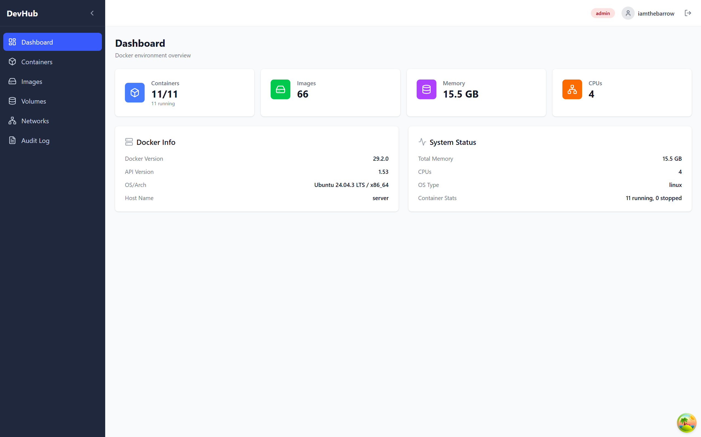
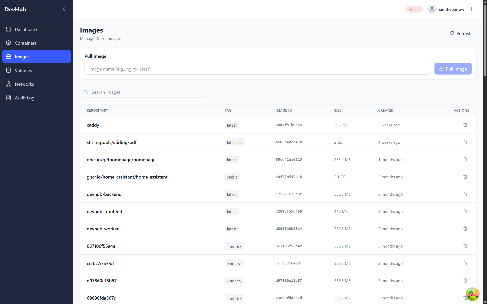

# Using the App

A walkthrough of the DevHub interface from login to day-to-day use.

---

## Logging In

Navigate to [http://localhost:3100](http://localhost:3100). You'll land on the login page.

Enter your username and password. On success, DevHub issues a short-lived access token (10 minutes by default) and stores a refresh token as an HttpOnly cookie. You will stay logged in automatically — the app silently refreshes your session in the background.

!!! info "Locked Out?"
    After 5 failed login attempts, the account is locked for 15 minutes. This is configurable via `AXES_FAILURE_LIMIT` and `AXES_COOLOFF_MINUTES` in your `.env`. See [Troubleshooting](troubleshooting.md) for manual unlock steps.

---

## Navigation

After logging in you land on the Dashboard. The sidebar on the left gives you access to every section:

| Sidebar Item | What It Shows |
|---|---|
| Dashboard | System overview and container counts |
| Containers | All containers, running and stopped |
| Images | All local Docker images |
| Volumes | All Docker volumes (read-only) |
| Networks | All Docker networks (read-only) |
| Audit | History of all actions taken through DevHub |

---

## Dashboard

The Dashboard gives you an at-a-glance view of your Docker engine and the state of your containers.

It shows:
- Docker engine version and host info
- Total container count broken down by status (running, stopped, etc.)
- System-level stats pulled from the Docker API

---

## Containers

The Containers page lists all containers — running and stopped.

### Browsing Containers

You can search and filter the list. Each row shows the container name, image, status, and available actions.

### Container Detail

Click any container to open its detail page. Here you'll find:

- Container metadata (ID, image, status, ports, mounts, environment)
- Live logs (tail mode)
- Lifecycle action buttons: **Start**, **Stop**, **Restart**

!!! info "Role Requirements for Actions"
    Starting, stopping, and restarting containers requires the **Operator** or **Admin** role. Viewers can read but not act.

---

## Images

The Images page lists all images stored on your Docker host.

From here you can:
- **Pull** a new image by name (e.g. `nginx:latest`) — this runs asynchronously as a background task
- **Remove** an image — requires **Admin** role

!!! warning "Removing Images"
    Image removal is permanent and requires the Admin role. DevHub will not remove images that are in use by running or stopped containers.

---

## Volumes

The Volumes page is a read-only list of all Docker volumes on the host. It shows volume name, driver, and mount point. No mutations are supported from this view.

---

## Networks

The Networks page is a read-only list of all Docker networks. It shows network name, driver, and scope. No mutations are supported from this view.

---

## Audit Log

Every meaningful action performed through DevHub — login, logout, container start/stop/restart, image pull/remove — is recorded in the audit log.

The Audit page lets you browse these events. You can filter by actor, action type, resource, and date range.

Records are **immutable** — they cannot be edited or deleted, even by an admin. This makes the audit log a reliable paper trail.

---

## Logging Out

Click the user menu in the top bar and select **Log Out**. This invalidates your refresh token on the server. Simply closing the browser tab does not invalidate the session — always log out explicitly on shared machines.
